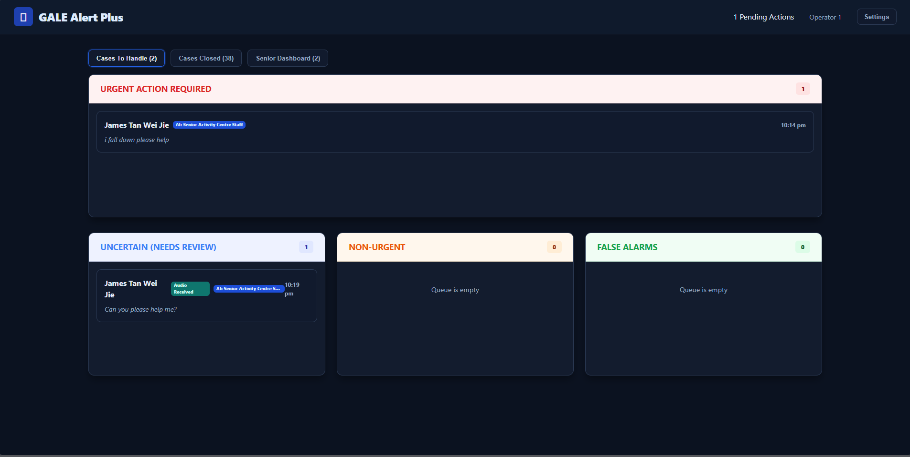
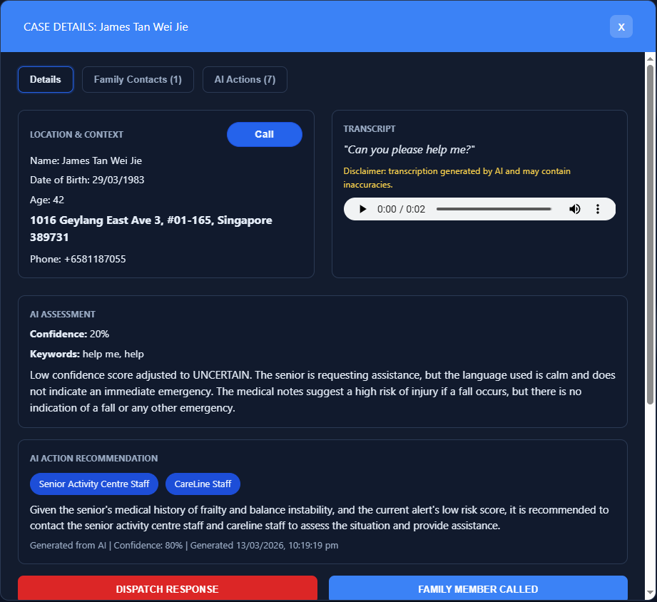
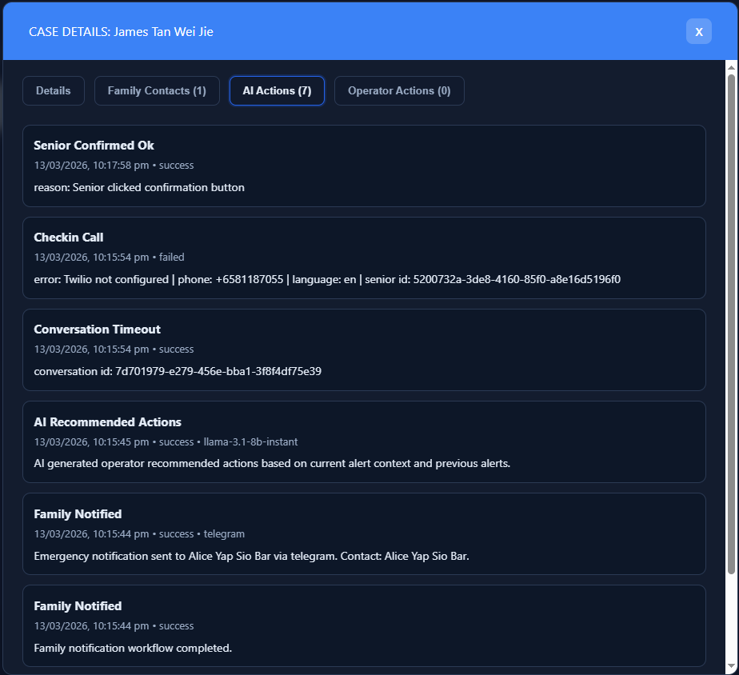
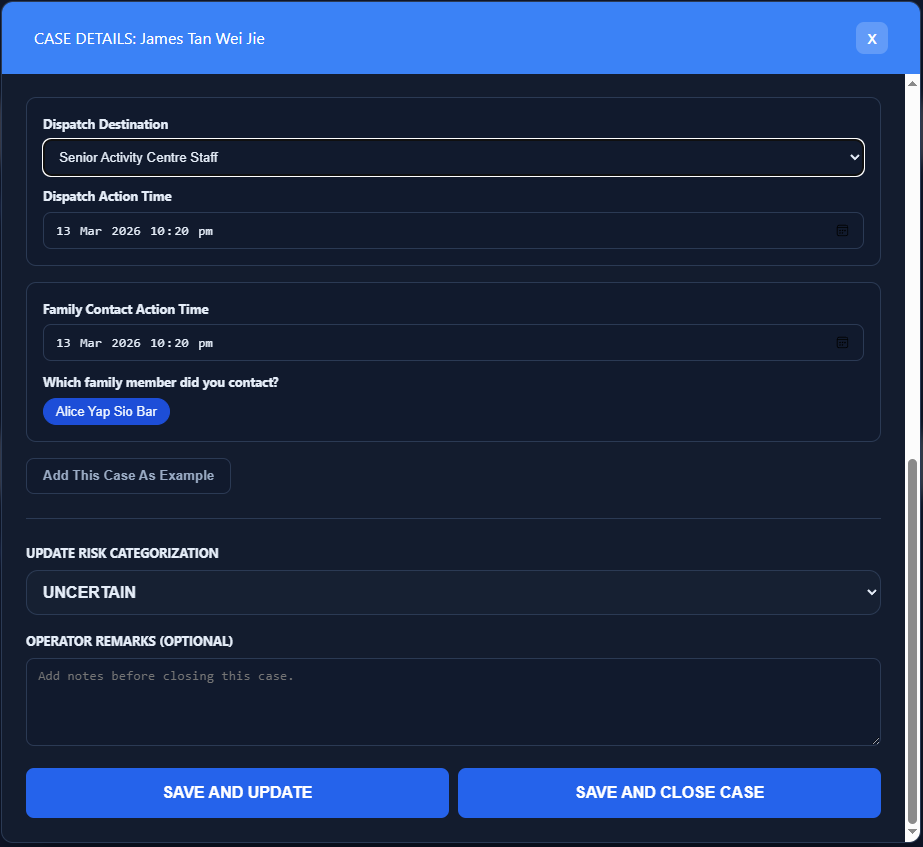
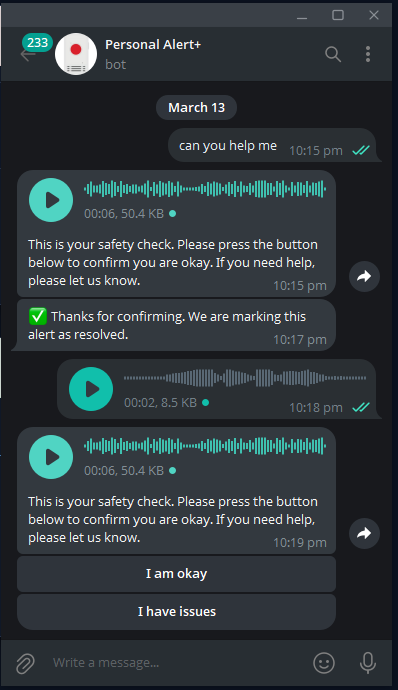
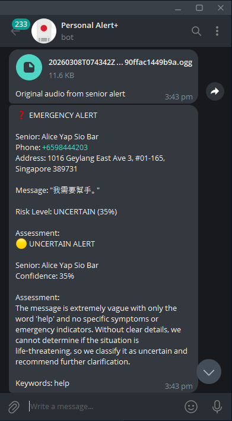

# PersonalAlertPlus

AI-Assisted Digital Extension for Singapore's GovTech Personal Alert Button (PAB)


---

## 📋 Project Overview

PersonalAlertPlus consists of three main components:

| Component | Description |
|-----------|-------------|
| 🤖 **Telegram Bot** | Senior registration, profile management, and alert submission via voice/text messages |
| 🧠 **Backend API** | FastAPI-powered AI processing pipeline (STT, translation, risk classification, notifications) |
| 📊 **Operator Dashboard** | React-based real-time alert queue, case management, and action logging |

---

## 👥 Team

| Name | Role |
|------|------|
| Bruce | Backend Developer, Database |
| Charles | Voice Transcribe, Speech-to-Text, Live Demo |
| Jensen | Operator Dashboard, Presentation Deck |

**Event:** [Hackomania 2026](https://hackomania.geekshacking.com/)
**Team:** [ModelMasterz](https://www.linkedin.com/company/modelmasterz/)

🔗 [Slide Deck](https://personal-alert-plus.vercel.app/slides) · [System Diagram](flowchart.md) · [API Endpoints](flowchart.md#quick-reference-api-endpoints) · [Sequence Diagram](flowchart.md#end-to-end-data-flow)

---

## 📑 Table of Contents

1. [What is PersonalAlertPlus?](#what-is-personalalertplus)
2. [Screenshots](#screenshots)
3. [System Architecture](#system-architecture)
4. [Tech Stack](#tech-stack)
5. [How to Run](#how-to-run)
6. [Project Structure](#project-structure)

---

## What is PersonalAlertPlus?

PersonalAlertPlus is an AI-assisted triage layer that extends Singapore's official Personal Alert Button (PAB) system with intelligent digital channels.

### ✨ Key Highlights

- 📱 **Digital Emergency Channel** – Seniors can trigger alerts via Telegram voice or text messages, expanding beyond the physical hardware button
- 🧠 **AI-Powered Triage** – Automatic speech-to-text transcription, language detection, translation, and risk classification (URGENT / NON_URGENT / UNCERTAIN / FALSE_ALARM)
- 📊 **Operator Dashboard** – Real-time alert queue with AI recommendations, case management, and action logging
- 👨‍👩‍👧 **Family Notifications** – Automatic Telegram notifications with SMS fallback
- ⏰ **Safety Net** – Timeout safety checks with Twilio voice call follow-ups for uncertain cases
- 🔒 **Human-in-the-Loop** – AI assists but never auto-dispatches; operators always make the final decision

---

## 📸 Screenshots

### Operator Dashboard

| Home - Alert Queue | Case Details & AI Assessment |
|-------------------|------------------------------|
|  |  |

| Case Handling - AI Actions | Case Handling - Senior Follow-up |
|------------------------|-----------------------------------|
|  |  |

### Telegram Bot

| Uncertain Case Confirmation | Family Alert (Other Language) |
|-----------------------------|-------------------------------|
|  | 

---

## 🏗 System Architecture

```
┌─────────────────────────────────────────────────────────────────────────────┐
│                              Senior                                         │
│   (Telegram Voice/Text Alert)                                                │
└─────────────────────────────────┬───────────────────────────────────────────┘
                                  │
                                  ▼
┌─────────────────────────────────────────────────────────────────────────────┐
│                         Telegram Bot Layer                                  │
│   • Registration (/start)                                                    │
│   • Profile Management (/profile)                                            │
│   • Alert Submission                                                         │
│   • Confirmation/Escalation Callbacks                                        │
└─────────────────────────────────┬───────────────────────────────────────────┘
                                  │
                                  ▼
┌─────────────────────────────────────────────────────────────────────────────┐
│                           FastAPI Backend                                    │
│   • Brain Orchestrator (alerts/ingest)                                       │
│   • Speech-to-Text (Whisper via Groq)                                       │
│   • Risk Classification Engine (LLM via OpenRouter)                         │
│   • Notification Service (Telegram + Twilio SMS/Voice)                     │
│   • Operator API Routes                                                      │
└─────────────────────────────────┬───────────────────────────────────────────┘
                                  │
                                  ▼
┌─────────────────────────────────────────────────────────────────────────────┐
│                         Supabase (PostgreSQL)                                │
│   seniors | emergency_contacts | alerts | ai_actions | operator_actions     │
│   senior_conversations | few_shot_examples | prompt_settings                 │
│   operator_action_recommendations                                            │
└─────────────────────────────────┬───────────────────────────────────────────┘
                                  │
                                  ▼
┌─────────────────────────────────────────────────────────────────────────────┐
│                         Operator Dashboard                                  │
│   React 19 + Vite + TypeScript                                              │
│   • Live Alert Queue                                                         │
│   • AI Assessment View                                                       │
│   • Action Logging (dispatch, call family, attended)                        │
│   • Senior & Contact Management                                             │
│   • Few-Shot Example Manager                                                │
│   • AI Recommendation Panel                                                │
│   • SIP Click-to-Call                                                        │
└─────────────────────────────────────────────────────────────────────────────┘
```

---

## 🛠 Tech Stack

| Layer | Technology |
|-------|------------|
| 🤖 **Telegram Bot** | `python-telegram-bot v22` |
| 🐍 **Backend** | FastAPI (Python 3.12+) |
| 🧠 **AI - STT** | GroqCloud (Whisper) |
| 🧠 **AI - LLM** | OpenRouter (OpenAI-compatible) |
| 🗄 **Database** | Supabase (PostgreSQL + RLS) |
| 📦 **Storage** | Supabase Storage (audio files) |
| 📱 **Notifications** | Telegram Bot API, Twilio (SMS + Voice) |
| 📊 **Dashboard** | React 19 + Vite + TypeScript |
| 🚀 **Deployment** | Vercel (Frontend), Localhost (Backend) |

---

## 🚀 How to Run

### Prerequisites

- 🐍 Python 3.12+
- 📦 Node.js 18+
- 🗄 Supabase project (PostgreSQL + Storage bucket)
- 🤖 Telegram Bot Token
- 🧠 GroqCloud / OpenRouter API key
- 📱 Twilio account (optional, for SMS/Voice fallback)

### 1. Install Dependencies

```bash
# Backend
pip install -r requirements.txt

# Frontend (dashboard)
cd dashboard && npm install
```

### 2. Configure Environment

```bash
cp .env.example .env
```

Fill in the required variables:

```env
# ===========================================
# TELEGRAM BOT
# ===========================================
TELEGRAM_BOT_TOKEN=your_bot_token

# ===========================================
# SUPABASE
# ===========================================
SUPABASE_URL=https://your-project.supabase.co
SUPABASE_SECRET_KEY=your_service_role_key
SUPABASE_AUDIO_BUCKET=alerts-audio
BACKEND_API_URL=http://127.0.0.1:8000

# Bot Mode: polling (local) or webhook (production)
BOT_MODE=polling
BOT_WEBHOOK_URL=
BOT_WEBHOOK_SECRET=

# ===========================================
# AI PROVIDER - LLM (OpenAI-compatible)
# ===========================================
AI_API_BASE_URL=https://openrouter.ai/api/v1
AI_API_KEY=your_openrouter_key
AI_CHAT_MODEL=gpt-4o-mini
AI_REQUEST_TIMEOUT_SECONDS=30
AI_MAX_RETRIES=3
AI_TEMPERATURE=0.1

# ===========================================
# AI PROVIDER - STT (GroqCloud)
# ===========================================
AI_API_BASE_URL_STT=https://api.groq.com/openai/v1
AI_API_KEY_STT=your_groq_key
AI_TRANSCRIPTION_MODEL=whisper-large-v3

# ===========================================
# SMS FALLBACK (Twilio)
# ===========================================
SMS_PROVIDER=twilio
TWILIO_ACCOUNT_SID=
TWILIO_AUTH_TOKEN=
TWILIO_FROM_NUMBER=
TWILIO_MESSAGING_SERVICE_SID=

# ===========================================
# BRAIN BEHAVIOR
# ===========================================
BRAIN_PROCESSING_TIMEOUT_SECONDS=45
BRAIN_ENABLE_SMS_FALLBACK=true
BRAIN_NOTIFY_TELEGRAM_FIRST=true
```

### 3. Setup Database

Run the migrations in `database/` in order:
- `000-master.sql` - Core tables
- `001-operator-actions-table-and-backfill.sql`
- `002-remove-legacy-alert-action-columns.sql`
- `003-add-alert-ai-assessment-column.sql`
- `004-operator-action-recommendations-table.sql`
- `005-add-sip-url-columns.sql`
- `006-add-alert-operator-remarks-column.sql`

### 4. Start the Application

```bash
# Start both bot and API
python main.py

# Or separately (API only):
uvicorn app.main:app --reload --host 0.0.0.0 --port 8000
```

### 5. Start Dashboard (Development)

```bash
cd dashboard
npm run dev
```

---

## 📁 Project Structure

```
PersonalAlertPlus/
├── app/
│   ├── brain/               # AI processing layer
│   │   ├── orchestrator.py  # Main pipeline
│   │   ├── risk_engine.py   # Classification logic
│   │   ├── notification_service.py
│   │   └── ...
│   ├── bot/                 # Telegram handlers
│   ├── services/            # Database, storage, API clients
│   ├── models/              # Pydantic schemas
│   ├── config.py            # Configuration
│   └── main.py              # FastAPI app entry
├── dashboard/               # React operator dashboard
│   ├── src/
│   │   ├── App.tsx
│   │   └── ...
│   └── package.json
├── database/                # SQL migrations
│   ├── 000-master.sql
│   └── ...
├── assets/
│   ├── audio/               # Multilingual TTS messages
│   └── screenshots/         # README images
├── .env.example
├── requirements.txt
├── main.py
├── flowchart.md             # Detailed system diagrams & API endpoints
└── agent.md                 # Full specification
```

---

## 📜 License

[MIT License](LICENSE)
