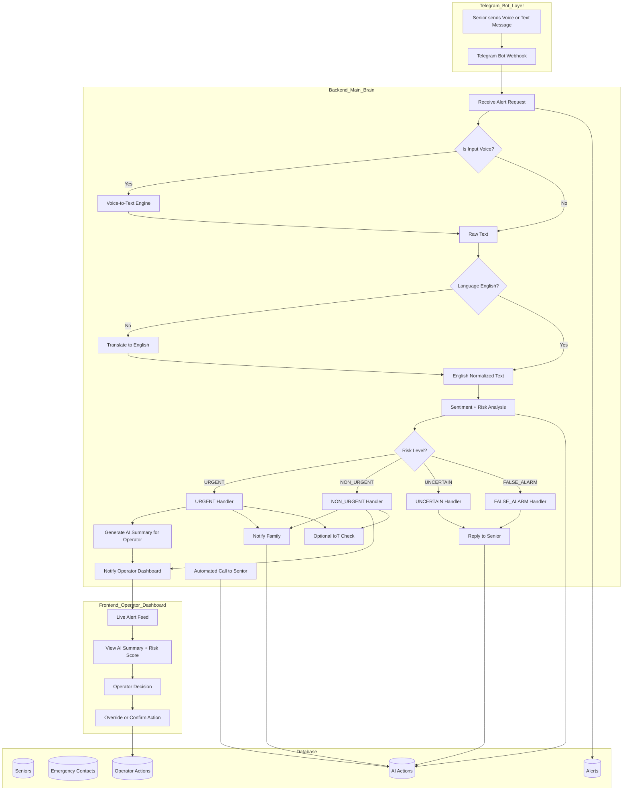

🛡 PersonalAlertPlus
AI-Assisted Digital Extension for GovTech Personal Alert Button (PAB)

---

## 1. 📌 Project Overview

* PersonalAlertPlus is an AI-assisted triage layer designed to extend Singapore’s official Personal Alert Button (PAB) system with intelligent digital channels.

* This project expands on GovTech’s PAB platform:

  * 🔗 [https://www.developer.tech.gov.sg/products/categories/sensor-platforms-and-internet-of-things/pab/overview](https://www.developer.tech.gov.sg/products/categories/sensor-platforms-and-internet-of-things/pab/overview)

* The official PAB:

  * Is a hardware-based emergency alert device
  * Installed in seniors’ homes
  * Sends a 10-second recording to a response centre when pressed
  * Includes senior tagging and address metadata

* PersonalAlertPlus extends this infrastructure by:

  * Adding Telegram-based emergency triggers
  * Automating transcription and triage
  * Assisting operators with urgency scoring
  * Reducing workload for non-critical alerts
  * Accelerating response for critical emergencies

* PersonalAlertPlus does not replace PAB.

* It enhances accessibility and triage efficiency.

---

## 2. 🎯 Problem Statement

* While the PAB system is effective, several operational challenges exist:

  * Seniors may not be near the hardware button
  * Operators must manually interpret raw audio
  * Language and dialect differences complicate assessment
  * High volume of accidental or NON_URGENT alerts
  * No automated triage assistance layer

* We aim to:

  * Extend emergency triggering beyond physical hardware
  * Use AI to assist operator decision-making
  * Improve emergency response time
  * Reduce unnecessary escalation
  * Introduce structured feedback for continuous improvement

---

## 3. 🧠 Core Solution

* PersonalAlertPlus introduces:

### 🔹 Digital Emergency Channel

* Seniors can:

  * Send a Telegram voice message
  * Trigger an emergency from anywhere
  * Automatically attach profile metadata

* This acts as a digital redundancy layer to the hardware PAB.

### 🔹 AI Processing Pipeline

* Upon receiving voice input:

  * Speech-to-text transcription
  * Language detection
  * Keyword extraction
  * Emergency classification
  * Confidence scoring

* Alerts are categorized into:

  * 🔴 URGENT – Immediate emergency
  * 🟠 NON_URGENT – Follow-up needed
  * 🟡 UNCERTAIN – Needs senior confirmation
  * 🟢 FALSE_ALARM – Accidental/no service request

### 🔹 AI Action Layer

* Based on classification:

* FALSE_ALARM

  * Reply with apology + option to escalate
  * Do not notify family by default
  * No operator required unless senior escalates

* UNCERTAIN

  * Reply to senior with bilingual confirmation message
  * Show inline buttons: "I am okay" and "Escalate"
  * If senior escalates, route to NON_URGENT flow and notify family

* NON_URGENT

  * Notify family
  * Escalate to operations as NON_URGENT
  * Mark case for operator follow-up

* URGENT

  * Notify family immediately
  * Escalate to operations as URGENT priority
  * Mark case for urgent operator handling

* AI assists. Humans decide.

### 🔹 Operator Dashboard

* Operators can:

  * View live alerts
  * See transcription + language
  * View risk score & reasoning
  * Confirm or override AI decision
  * Add a case directly into `few_shot_examples` with one click
  * Manage emergency contacts in a dedicated pop-up interface
  * View senior medical notes during contact management
  * Edit base AI risk prompt in a Settings tab

* This builds a supervised AI improvement cycle.

---

## 4. 🏗 System Architecture

* Components:

  * Telegram Bot → Senior trigger channel
  * FastAPI Backend → AI processing & orchestration
  * Supabase (Postgres + RLS) → Secure data storage
  * React + Vite Dashboard → Operator interface
  * (Optional) ClickHouse → Analytics layer

---

## 4b. 🤖 Telegram Bot Features

### Registration Flow (`/start`)

When a senior first contacts the bot, they go through a step-by-step registration:

1. **Language Selection** - User selects preferred language from 6 options:
   - English, 中文 (Chinese), Bahasa Melayu (Malay), தமிழ் (Tamil), Hokkien, Cantonese
   
2. **Required Fields** (all subsequent prompts in selected language):
   - Full Name (2-100 characters)
   - Phone Number (8 digits, auto-adds +65)
   - Address (10-500 characters)
   - Birth Year (must be 18+ years old)
   - Birth Month (1-12)
   - Birth Day (valid for selected month)

3. **Optional Field**:
   - Medical Notes (max 2000 characters, with Skip option)

### Profile Management (`/profile`)

Registered seniors can view and update their profile:

- **View Profile**: Shows all details (name, phone, address, birthday, language, medical notes)
- **Update Options**: Inline buttons to update:
  - Phone Number
  - Address
  - Medical Notes
- All updates include input validation

### Alert Submission

After registration, seniors can send:
- **Voice messages** - Uploaded to Supabase Storage, alert record created, forwarded to backend API
- **Text messages** - Alert record created with transcription, forwarded to backend API

**Note:** Bot does NOT send immediate "alert received" message. Instead, the Brain layer sends a confirmation message with the risk assessment after processing.

### Senior Confirmation & Escalation

After AI processing, seniors receive a confirmation message:
- Shows risk level detected
- Written in their **native language** + **English**
- For UNCERTAIN risk: includes "I am okay" and "Escalate" inline buttons
- For FALSE_ALARM risk: includes "Escalate" inline button
- When senior clicks "Escalate":
  - Alert is escalated to NON_URGENT
  - Emergency contacts are notified immediately
  - Alert marked for operator review

This provides a safety net in case AI misclassifies the situation.

---

## 5. 🔄 Alert Workflow

### Step 1 – Trigger

* Senior sends Telegram voice message.

### Step 2 – Ingestion

* Backend:

  * Stores metadata
  * Retrieves senior profile
  * Links to address and medical notes

### Step 3 – AI Processing

* Transcription
* Language detection
* Risk classification
* Confidence scoring

### Step 4 – AI Decision

* FALSE_ALARM → Reply with apology + Escalate option
* UNCERTAIN → Ask for confirmation from senior ("I am okay" / "Escalate")
* NON_URGENT → Notify family + escalate to operator as NON_URGENT
* URGENT → Notify family + escalate to operator as URGENT priority

### Step 5 – Operator Review

* Operator:

  * Reviews recommendation
  * Confirms dispatch or override
  * Logs decision
  * Rates AI accuracy

### Step 6 – Feedback Loop

* Operator feedback stored for:

  * Performance tracking
  * Future model refinement
  * System reliability metrics

---

## 5b. 📊 Alert Data Flow



### Bot → Backend API Payload

When the bot receives an alert, it sends this payload to the backend:

```json
{
  "alert_id": "uuid",
  "senior_id": "uuid",
  "telegram_user_id": "string",
  "channel": "telegram",
  "audio_url": "https://...",
  "text": "string"
}
```

The backend retrieves senior details (name, phone, address, medical notes) using the `senior_id`.

---

## 6. 🗄 Database Design

* Fresh-start bootstrap SQL is provided at `database/000-master.sql`.
* Migration rule: never modify historical migration files; append new numbered migrations only.

* Core Tables:

  * seniors
  * emergency_contacts
  * alerts
  * ai_actions
  * few_shot_examples
  * senior_conversations
  * prompt_settings

---

### 6.1 📋 Seniors Table (`public.seniors`)

Registered seniors profile information.

| Field | Type | Required | Description |
|-------|------|----------|-------------|
| id | uuid | Yes | Auto-generated primary key |
| full_name | text | Yes | Senior's full name |
| phone_number | text | Yes | Singapore format (+65XXXXXXXX), unique |
| telegram_user_id | text | No | Telegram user ID (for bot auth) |
| address | text | Yes | Residential address |
| birth_year | int | No | Year of birth (YYYY) |
| birth_month | int | No | Month of birth (1-12) |
| birth_day | int | No | Day of birth (1-31) |
| preferred_language | text | No | en/zh/ms/ta/nan/yue |
| medical_notes | text | No | Medical conditions/notes (max 2000 chars) |
| created_at | timestamptz | Yes | Registration timestamp (auto-generated) |

---

### 6.2 👥 Emergency Contacts Table (`public.emergency_contacts`)

Contacts to notify in case of emergency.

| Field | Type | Required | Description |
|-------|------|----------|-------------|
| id | uuid | Yes | Auto-generated primary key |
| senior_id | uuid | Yes | Foreign key to seniors(id) |
| name | text | Yes | Contact's full name |
| relationship | text | No | Relationship to senior (e.g., Son, Daughter) |
| phone_number | text | No | Contact's phone number |
| telegram_user_id | text | No | Contact's Telegram user ID |
| priority_order | int | No | Contact priority (1 = highest) |
| notify_on_uncertain | bool | No | Whether this contact receives UNCERTAIN alerts |
| created_at | timestamptz | Yes | Creation timestamp |

---

### 6.3 🚨 Alerts Table (`public.alerts`)

Emergency alerts triggered by seniors.

| Field | Type | Required | Description |
|-------|------|----------|-------------|
| id | uuid | Yes | Auto-generated primary key |
| senior_id | uuid | Yes | Foreign key to seniors(id) |
| channel | text | Yes | Source channel (telegram/sms/whatsapp) |
| audio_url | text | No | URL to voice message in Supabase Storage |
| transcription | text | No | Text content or voice-to-text result |
| language_detected | text | No | Detected language (en/zh/ms/ta/etc) |
| translated_text | text | No | English translation of transcript |
| risk_level | text | No | URGENT/NON_URGENT/UNCERTAIN/FALSE_ALARM classification |
| risk_score | numeric | No | AI confidence score (0.0-1.0) |
| analysis_summary | text | No | AI-generated summary for operators |
| keywords | jsonb | No | Array of keywords extracted |
| status | text | No | pending/pending_confirmation/escalated/closed |
| requires_operator | boolean | No | Whether operator intervention needed |
| resolved_by | text | No | Who resolved (ai/operator) |
| processing_status | text | No | pending/processing/completed/failed |
| processing_error | text | No | Error message if processing failed |
| created_at | timestamptz | Yes | Alert creation timestamp |

---

### 6.4 🤖 AI Actions Table (`public.ai_actions`)

Automated AI-triggered actions based on risk assessment.

| Field | Type | Required | Description |
|-------|------|----------|-------------|
| id | uuid | Yes | Auto-generated primary key |
| alert_id | uuid | Yes | Foreign key to alerts(id) |
| action_type | text | Yes | Type of action (notify_family/escalate/call_senior/senior_escalated) |
| action_status | text | No | pending/success/failed (default: pending) |
| details | jsonb | No | Action-specific data (method, message, etc) |
| provider | text | No | Provider used (e.g., telegram, twilio, openai) |
| attempt_count | int | No | Number of attempts made |
| external_ref | text | No | External reference (e.g., Twilio message SID) |
| error_message | text | No | Error message if action failed |
| created_at | timestamptz | Yes | Action creation timestamp |

---

### 6.5 🔐 Security Model

  * Seniors have no direct DB access
  * Backend uses Supabase service role
  * Operators authenticate via Supabase Auth
  * Row Level Security enabled
  * Public access blocked

---

## 7. 🔐 Security & Governance

* Hackathon-grade secure:

  * No public database access
  * No client-side service keys
  * Operator login required
  * Audit trail for all AI + operator actions

* AI never auto-dispatches emergency services.

* Human-in-the-loop design is enforced.

---

## 8. 🧪 Example Scenarios

### 🟢 Accidental Press (FALSE_ALARM)

* Transcript:

  * "Sorry I pressed wrongly."

* AI:

  * FALSE_ALARM risk (0.12)
  * Senior receives apology + "Escalate" button
  * No family notification by default
  * If senior clicks button → escalate to NON_URGENT and notify family

### 🟡 Unclear Distress (UNCERTAIN)

* Transcript:

  * "I feel a bit dizzy but I'm okay."

* AI:

  * UNCERTAIN risk (0.45)
  * Senior receives "I am okay" + "Escalate" buttons
  * No family notification unless escalation is requested
  * If senior clicks escalate → move to NON_URGENT and notify family

### 🟠 Follow-up Needed (NON_URGENT)

* Transcript:

  * "I feel weak and need someone to check on me soon."

* AI:

  * NON_URGENT risk (0.68)
  * Family is notified
  * Case is escalated to operations as NON_URGENT
  * Operator follows up shortly

### 🔴 Fall Incident (URGENT)

* Transcript:

  * "I fell and cannot stand up."

* AI:

  * URGENT risk (0.94)
  * Escalates immediately
  * Displays address & medical history
  * Suggests ambulance dispatch
  * Senior receives confirmation (no button - already escalated)

* Operator confirms action.

---

## 9. 🏆 Hackathon Positioning

* PersonalAlertPlus is positioned as:

  * An AI-assisted triage extension that enhances GovTech’s Personal Alert Button ecosystem through intelligent digital accessibility and operator support.

* We extend infrastructure.

* We do not replace it.

---

## 10. 🔮 Future Enhancements

* WhatsApp integration
* Dialect fine-tuned speech models
* Real-time analytics via ClickHouse
* Risk trend heatmaps
* AI retraining from operator feedback
* Integration with emergency dispatch APIs
* SMS fallback channel (implemented)
* Caregiver mobile app
* Automated follow-up call to senior (deferred from hackathon)
* Multi-language operator dashboard
