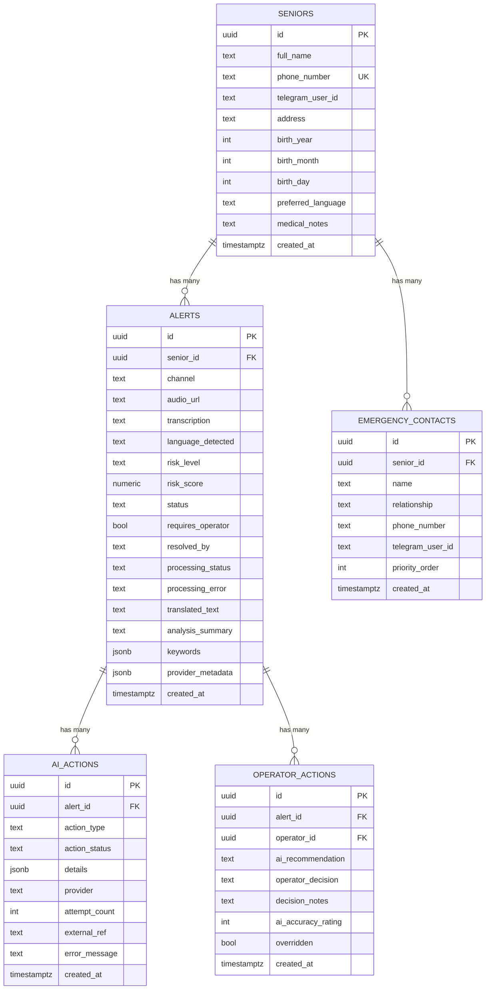
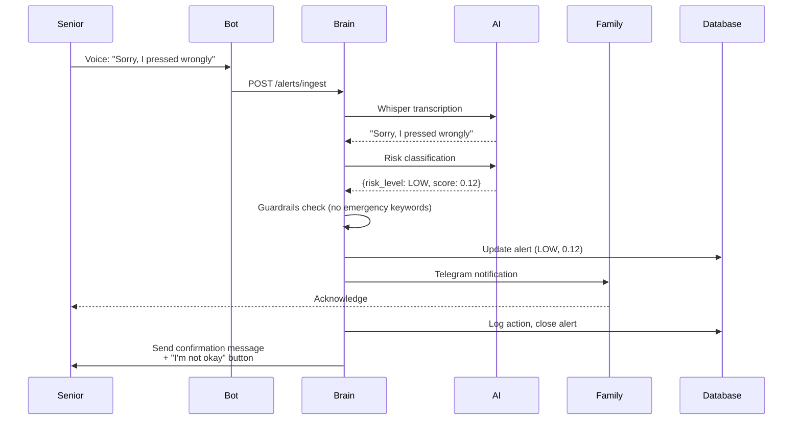
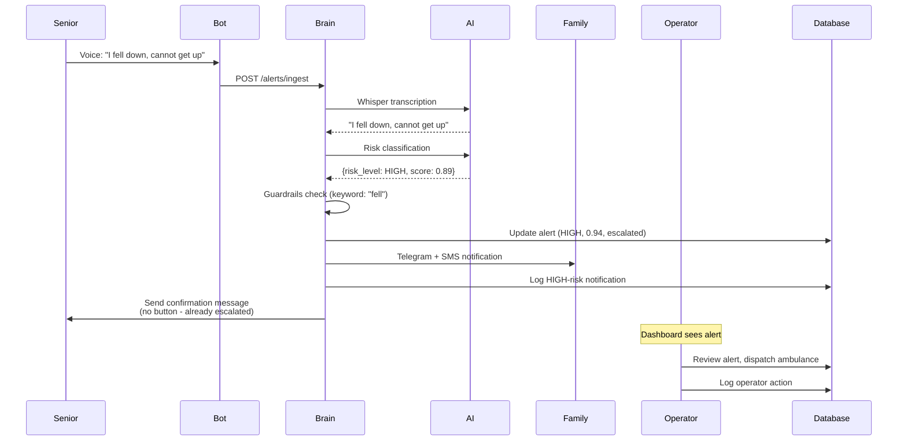
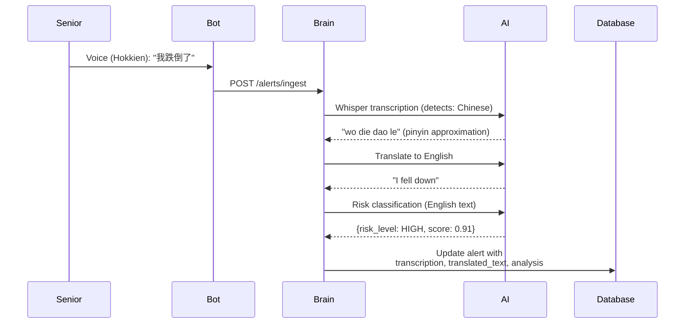
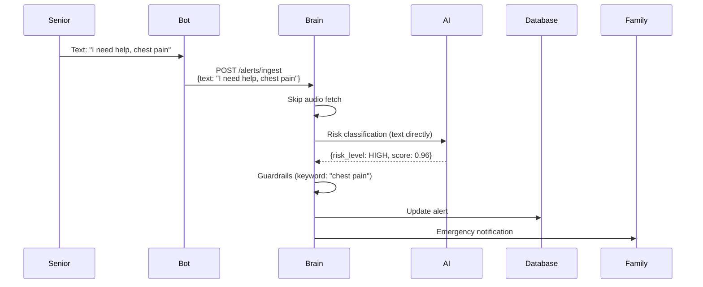
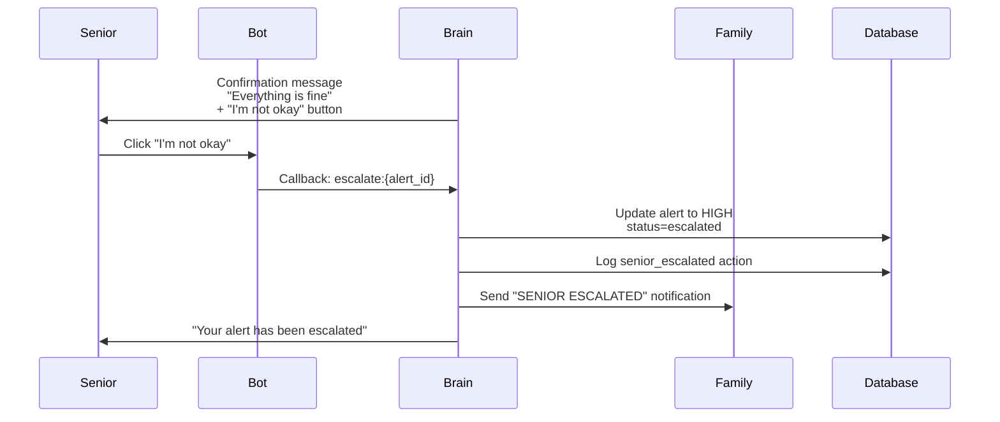

# PersonalAlertPlus - System Flowchart

## High-Level Architecture

---

## Data Flow Diagram

---

## Database Schema Flow

---

## Case Examples

### Case 1: Accidental Press (LOW Risk)

**Flow Summary:**
1. Senior sends voice message accidentally
2. Bot uploads to Supabase → calls brain endpoint
3. Whisper transcribes → "Sorry, I pressed wrongly"
4. LLM classifies as **LOW risk** (0.12 confidence)
5. Guardrails confirm no emergency keywords
6. Alert saved with `risk_level=LOW`, `status=closed`
7. Family notified via Telegram
8. **Senior receives confirmation message with "I'm not okay" button**
9. If senior clicks button → escalate to HIGH

---

### Case 2: Fall Incident (HIGH Risk)

**Flow Summary:**
1. Senior sends voice: "I fell down, cannot get up"
2. Bot uploads → calls brain endpoint
3. Whisper transcribes → "I fell down, cannot get up"
4. LLM classifies as **HIGH risk** (0.89)
5. Guardrails elevate due to "fell" keyword → 0.94
6. Alert saved with `risk_level=HIGH`, `status=escalated`, `requires_operator=true`
7. Family notified immediately via Telegram + SMS
8. **Senior receives confirmation message (no inline button - already escalated)**
9. Operator sees alert on dashboard, takes action

---

### Case 3: Non-English Voice (Chinese)

**Flow Summary:**
1. Senior sends voice in Hokkien
2. Whisper detects Chinese language
3. Transcription: "wo die dao le" (phonetic)
4. Translation prompt converts to English: "I fall down"
5. Classification runs on English text → HIGH risk
6. Database stores both original + translated text
7. Analysis summary generated for operator

---

### Case 4: Text Alert (No Voice)

**Flow Summary:**
1. Senior sends text message instead of voice
2. Bot calls brain endpoint with `text` field (no `audio_url`)
3. Brain skips audio fetch step
4. Classification runs directly on text
5. Guardrails elevate due to "chest pain" keyword
6. HIGH risk alert → immediate escalation
7. **Senior receives confirmation message with inline button**

---

### Case 5: Senior Escalation ("I'm not okay" Button)

**Flow Summary:**
1. Senior received LOW/MEDIUM confirmation with "I'm not okay" button
2. Senior feels worse, clicks the button
3. Bot handler processes callback `escalate:{alert_id}`
4. Alert upgraded to HIGH risk, status=escalated
5. Emergency contacts notified again with "SENIOR ESCALATED" message
6. Senior receives confirmation that alert was escalated

---

## Folder Structure Summary

| Folder/File | Purpose |
|-------------|---------|
| `app/bot/` | Telegram bot handlers, conversations, keyboards |
| `app/bot/handlers/alerts.py` | Handle voice/text alerts |
| `app/bot/handlers/profile.py` | Profile management commands |
| `app/bot/handlers/escalate.py` | "I'm not okay" callback handler |
| `app/bot/conversations/registration.py` | Registration flow |
| `app/brain/router.py` | FastAPI endpoints (`/api/v1/brain/*`) |
| `app/brain/orchestrator.py` | Main processing pipeline |
| `app/brain/providers/openai_compatible.py` | OpenAI/Whisper API client |
| `app/brain/services/audio_fetcher.py` | Download audio from Supabase |
| `app/brain/services/risk_engine.py` | Classification guardrails |
| `app/brain/services/notification_service.py` | Telegram/Twilio notifications |
| `app/brain/services/action_logger.py` | Log to `ai_actions` table |
| `app/brain/prompts.py` | LLM prompts & keyword detection |
| `app/services/database.py` | Supabase client wrapper |
| `app/services/storage.py` | Supabase Storage upload |
| `app/config.py` | Configuration & env variables |
| `app/main.py` | FastAPI app entry point |

---

## Quick Reference: API Endpoints

| Endpoint | Method | Description |
|----------|--------|-------------|
| `/health` | GET | Basic health check |
| `/telegram/webhook` | POST | Telegram bot updates |
| `/api/v1/brain/alerts/ingest` | POST | Process new alert |
| `/api/v1/brain/health` | GET | Brain service health |
