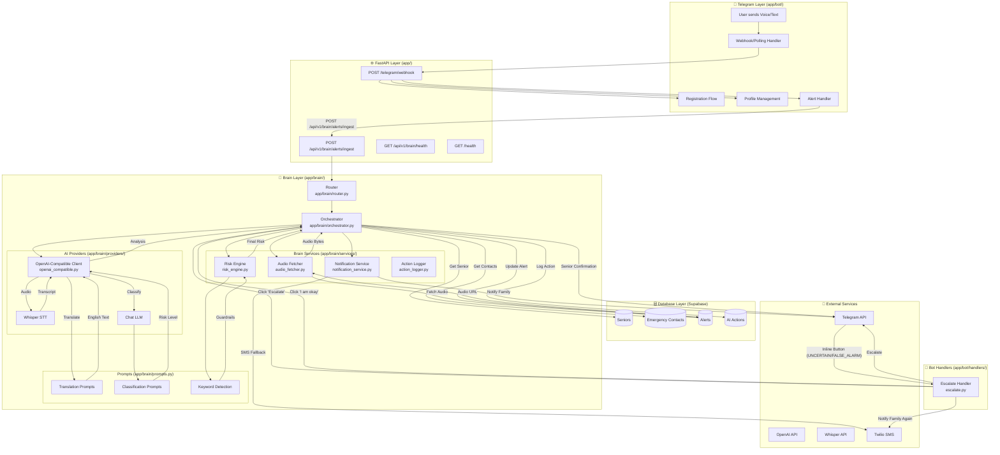
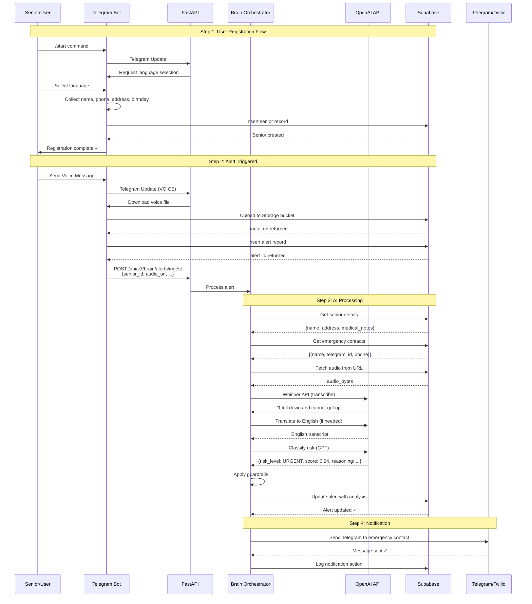
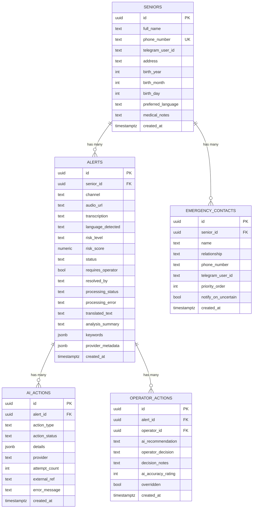
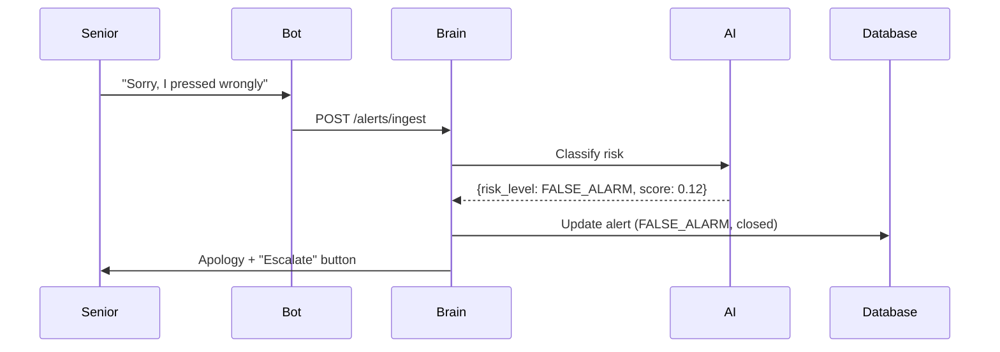
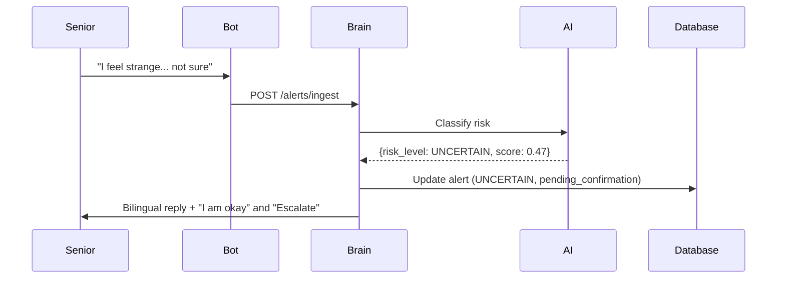
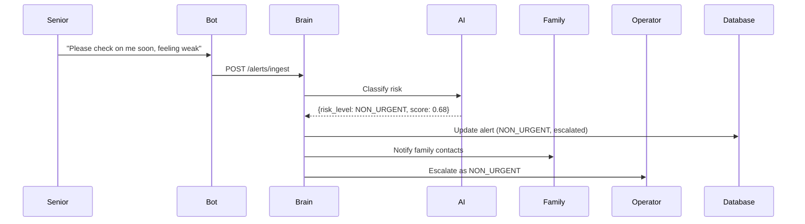
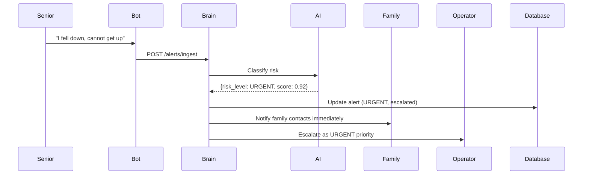
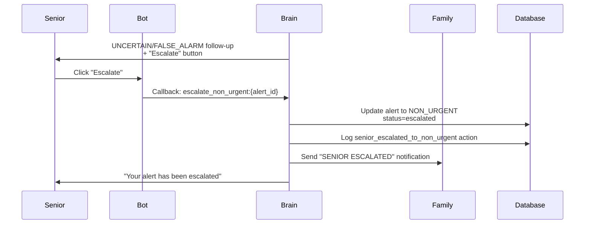

# PersonalAlertPlus - System Flowchart

## High-Level Architecture

---

## Data Flow Diagram

---

## Database Schema Flow

---

## Case Examples

### Case 1: FALSE_ALARM (Accidental Trigger)

**Flow Summary:**
1. Alert is classified as `FALSE_ALARM`.
2. System closes the case and does not notify family by default.
3. Senior can still click "Escalate" to move into the NON_URGENT flow.

---

### Case 2: UNCERTAIN (Needs Confirmation)

**Flow Summary:**
1. Alert is classified as `UNCERTAIN`.
2. System asks senior to confirm status via inline buttons.
3. Family is not notified unless senior escalates.

---

### Case 3: NON_URGENT (Follow-Up Required)

**Flow Summary:**
1. Alert is classified as `NON_URGENT`.
2. Family is notified.
3. Case is escalated to operations as NON_URGENT.

---

### Case 4: URGENT (Immediate Emergency)

**Flow Summary:**
1. Alert is classified as `URGENT`.
2. Family is notified immediately.
3. Case is escalated to operations with URGENT priority.

---

### Case 5: Senior Escalation (from UNCERTAIN/FALSE_ALARM)

**Flow Summary:**
1. Senior received UNCERTAIN/FALSE_ALARM follow-up with "Escalate" button.
2. Bot handler processes callback `escalate_non_urgent:{alert_id}`.
3. Alert is upgraded to NON_URGENT and marked for operator review.
4. Family is notified and senior receives escalation confirmation.

---

## Folder Structure Summary

| Folder/File | Purpose |
|-------------|---------|
| `app/bot/` | Telegram bot handlers, conversations, keyboards |
| `app/bot/handlers/alerts.py` | Handle voice/text alerts |
| `app/bot/handlers/profile.py` | Profile management commands |
| `app/bot/handlers/escalate.py` | Confirm/Escalate callback handler |
| `app/bot/conversations/registration.py` | Registration flow |
| `app/brain/router.py` | FastAPI endpoints (`/api/v1/brain/*`) |
| `app/brain/orchestrator.py` | Main processing pipeline |
| `app/brain/providers/openai_compatible.py` | OpenAI/Whisper API client |
| `app/brain/services/audio_fetcher.py` | Download audio from Supabase |
| `app/brain/services/risk_engine.py` | Classification guardrails |
| `app/brain/services/notification_service.py` | Telegram/Twilio notifications |
| `app/brain/services/action_logger.py` | Log to `ai_actions` table |
| `app/brain/prompts.py` | LLM prompts & keyword detection |
| `app/services/database.py` | Supabase client wrapper |
| `app/services/storage.py` | Supabase Storage upload |
| `app/config.py` | Configuration & env variables |
| `app/main.py` | FastAPI app entry point |

---

## Quick Reference: API Endpoints

| Endpoint | Method | Description |
|----------|--------|-------------|
| `/health` | GET | Basic health check |
| `/telegram/webhook` | POST | Telegram bot updates |
| `/api/v1/brain/alerts/ingest` | POST | Process new alert |
| `/api/v1/brain/health` | GET | Brain service health |
