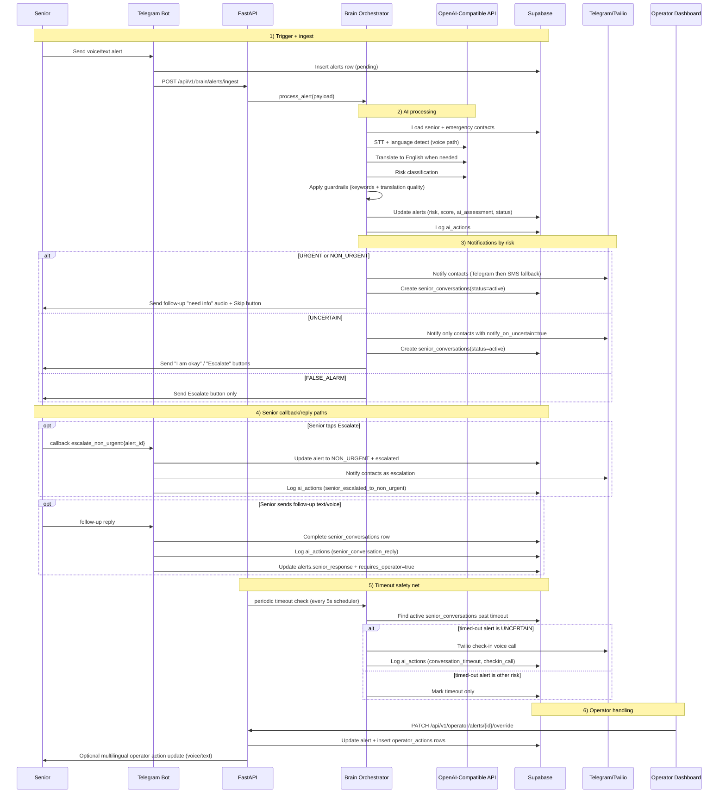
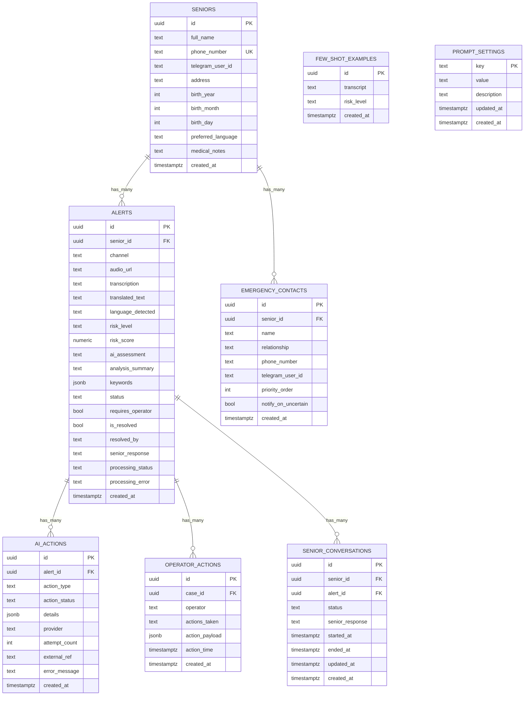

# PersonalAlertPlus - System Flowchart

## High-Level Architecture

```mermaid
flowchart TB
    subgraph Telegram["Telegram Layer (app/bot/)"]
        T1[Senior sends text or voice]
        T2[Registration + profile handlers]
        T3[Alert handlers]
        T4[Escalate/confirm/skip callbacks]
        T5[Conversation reply handler]
    end

    subgraph API["FastAPI Layer (app/)"]
        A1[POST /telegram/webhook]
        A2[GET /health]
        A3[POST /api/v1/brain/alerts/ingest]
        A4[GET /api/v1/brain/health]
        A5[POST /api/v1/brain/conversations/check-timeout]
        A6[Operator API routes]
    end

    subgraph Brain["Brain Layer (app/brain/)"]
        B1[router.py]
        B2[orchestrator.py]
        B3[speech_to_text.py]
        B4[risk_engine.py]
        B5[notification_service.py]
        B6[action_logger.py]
        B7[conversation_timeout.py]
        B8[twilio_call_service.py]
    end

    subgraph Dashboard["Operator Dashboard (dashboard/src/App.tsx)"]
        O1[Alerts queue + case modal]
        O2[Override + action logging]
        O3[Few-shot example manager]
        O4[Prompt settings manager]
        O5[Seniors + emergency contacts manager]
        O6[Conversation replies view]
    end

    subgraph DB["Supabase (Postgres + Storage)"]
        D1[(seniors)]
        D2[(emergency_contacts)]
        D3[(alerts)]
        D4[(ai_actions)]
        D5[(operator_actions)]
        D6[(few_shot_examples)]
        D7[(senior_conversations)]
        D8[(prompt_settings)]
        D9[(alerts-audio storage)]
    end

    subgraph External["External Services"]
        E1[Telegram API]
        E2[OpenAI-compatible AI API]
        E3[Twilio SMS]
        E4[Twilio Voice Call]
    end

    T1 --> T3
    T1 --> T5
    T3 --> A3
    T4 --> B2
    T5 --> D7
    T5 --> D4
    T5 --> D3

    A1 --> T2
    A1 --> T3
    A1 --> T4
    A2 --> B1
    A3 --> B1
    A4 --> B1
    A5 --> B7
    A6 --> O1

    B1 --> B2
    B2 --> B3
    B2 --> B4
    B2 --> B5
    B2 --> B6
    B7 --> B8

    B3 --> E2
    B4 --> E2
    B5 --> E1
    B5 --> E3
    B8 --> E4

    B2 --> D1
    B2 --> D2
    B2 --> D3
    B2 --> D4
    B2 --> D7
    B3 --> D9
    O2 --> D3
    O2 --> D5
    O3 --> D6
    O4 --> D8
    O5 --> D1
    O5 --> D2
    O6 --> D4
```

---

## End-to-End Data Flow

---

## Database Schema Flow

---

## Quick Reference: API Endpoints

| Endpoint | Method | Description |
|----------|--------|-------------|
| `/health` | GET | Basic service health check |
| `/telegram/webhook` | POST | Telegram update ingress (webhook mode) |
| `/api/v1/brain/alerts/ingest` | POST | Brain processing entrypoint |
| `/api/v1/brain/health` | GET | Brain health check |
| `/api/v1/brain/conversations/check-timeout` | POST | Manual timeout check trigger |
| `/api/v1/operator/alerts` | GET | Operator alert feed |
| `/api/v1/operator/alerts/{alert_id}/override` | PATCH | Override alert + persist operator action rows |
| `/api/v1/operator/alerts/{alert_id}/conversation-replies` | GET | Fetch recent senior follow-up replies |
| `/api/v1/operator/few-shot-examples` | GET | List few-shot examples |
| `/api/v1/operator/few-shot-examples` | POST | Create few-shot example |
| `/api/v1/operator/few-shot-examples/{example_id}` | PATCH | Update few-shot example |
| `/api/v1/operator/few-shot-examples/{example_id}` | DELETE | Delete few-shot example |
| `/api/v1/operator/seniors/overview` | GET | Senior overview for dashboard |
| `/api/v1/operator/seniors/{senior_id}/emergency-contacts` | GET | List contacts for one senior |
| `/api/v1/operator/seniors/{senior_id}/emergency-contacts` | POST | Create contact for one senior |
| `/api/v1/operator/emergency-contacts/{contact_id}` | PATCH | Update one emergency contact |
| `/api/v1/operator/emergency-contacts/{contact_id}` | DELETE | Delete one emergency contact |
| `/api/v1/operator/settings/risk-prompt` | GET/PUT | Read or update base risk prompt |

---

## Notes

- Timeout checking is run automatically by `apscheduler` in `app/main.py` every 5 seconds.
- `TwilioCallService` generates TwiML with gather action `/api/v1/twilio/gather`; that callback route is not implemented in this codebase yet.
- Operator action state is derived from `operator_actions` rows in the API layer and shown in the dashboard.
